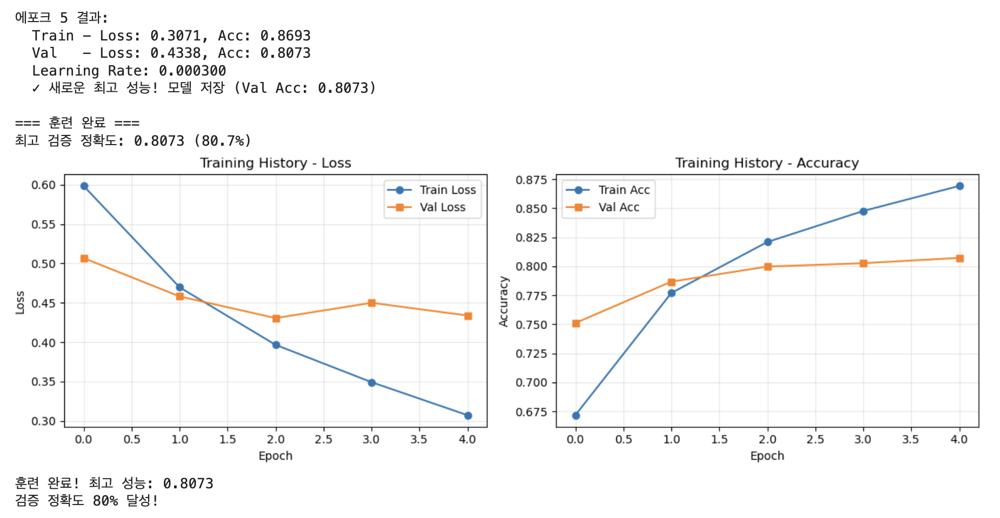
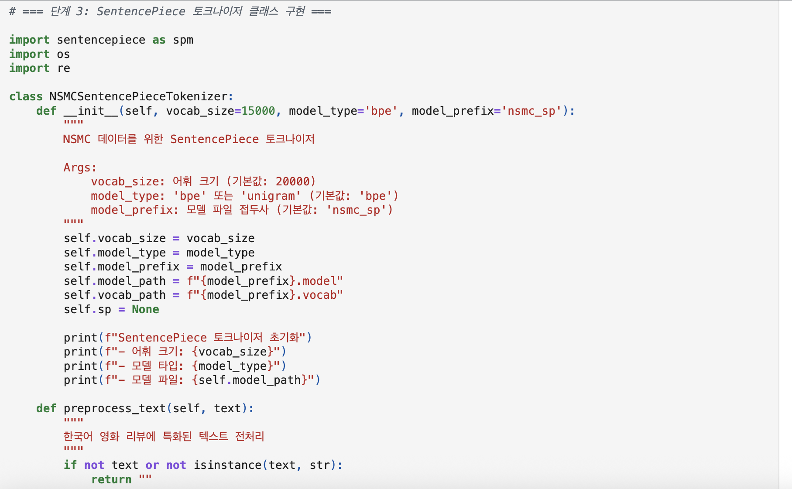
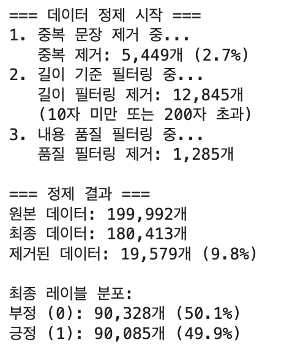
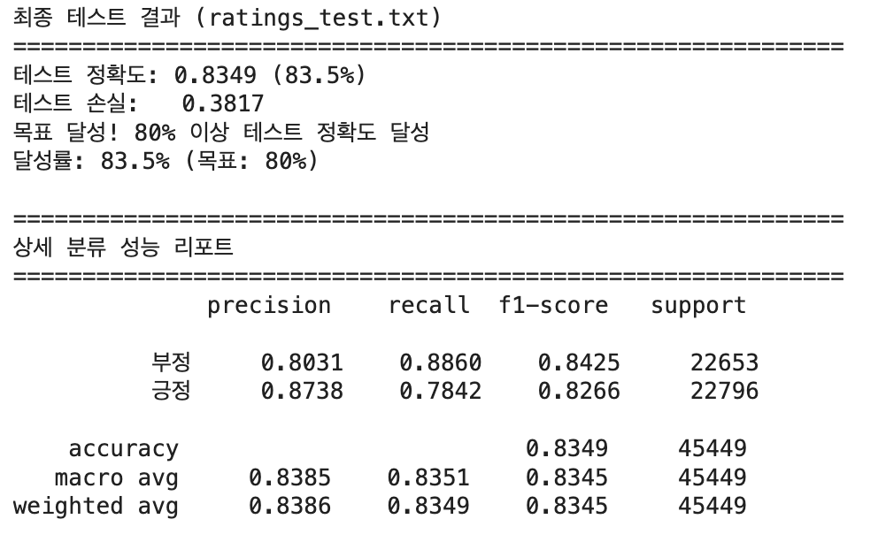
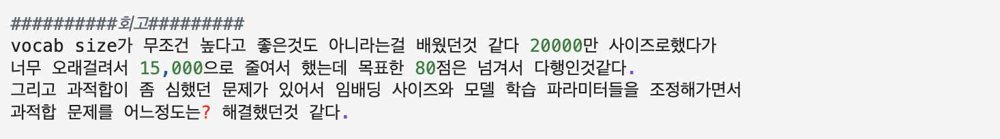
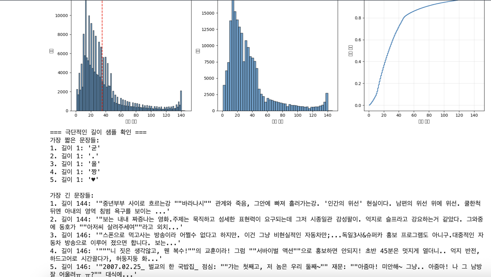
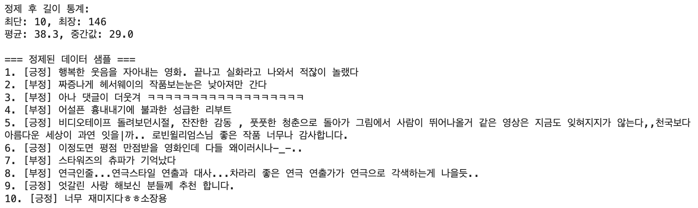

# AIFFEL Campus Online Code Peer Review Templete
- 코더 : 김석영
- 리뷰어 : 이규철


# PRT(Peer Review Template)
- [X]  **1. 주어진 문제를 해결하는 완성된 코드가 제출되었나요?**
    - 문제에서 요구하는 최종 결과물이 첨부되었는지 확인
        - 중요! 해당 조건을 만족하는 부분을 캡쳐해 근거로 첨부

문제에서 요구하는 다양한 토크나이저를 활용해 네이버 영화리뷰 데이터를 활용한 분류를 잘 수행하셔서 정확도 80을 넘기셨습니다.
    
- [X]  **2. 전체 코드에서 가장 핵심적이거나 가장 복잡하고 이해하기 어려운 부분에 작성된 
주석 또는 doc string을 보고 해당 코드가 잘 이해되었나요?**
    - 해당 코드 블럭을 왜 핵심적이라고 생각하는지 확인
    - 해당 코드 블럭에 doc string/annotation이 달려 있는지 확인
    - 해당 코드의 기능, 존재 이유, 작동 원리 등을 기술했는지 확인
    - 주석을 보고 코드 이해가 잘 되었는지 확인
        - 중요! 잘 작성되었다고 생각되는 부분을 캡쳐해 근거로 첨부

토크나이저를 선언하고 토크나이저를 학습시키는 과정을 잘 보여주셨습니다. 또한 상세하게 설명을 잘 해주셨습니다.
        
- [X]  **3. 에러가 난 부분을 디버깅하여 문제를 해결한 기록을 남겼거나
새로운 시도 또는 추가 실험을 수행해봤나요?**
    - 문제 원인 및 해결 과정을 잘 기록하였는지 확인
    - 프로젝트 평가 기준에 더해 추가적으로 수행한 나만의 시도, 
    실험이 기록되어 있는지 확인
        - 중요! 잘 작성되었다고 생각되는 부분을 캡쳐해 근거로 첨부

        
모델을 실험하면서 필요한 EDA를 거치고 데이터를 전처리부터 토크나이저를 통해 모델에 넣는 과정까지 문제가 생겼던 부분에 대한 얘기를 
친절하게 설명해주시며 해결했던 방법을 잘 말씀해 주셨습니다.

- [X]  **4. 회고를 잘 작성했나요?**
    - 주어진 문제를 해결하는 완성된 코드 내지 프로젝트 결과물에 대해
    배운점과 아쉬운점, 느낀점 등이 기록되어 있는지 확인
    - 전체 코드 실행 플로우를 그래프로 그려서 이해를 돕고 있는지 확인
        - 중요! 잘 작성되었다고 생각되는 부분을 캡쳐해 근거로 첨부

회고가 아주 잘 작성되어있습니다. 고생 많으셨습니다.
        
- [X]  **5. 코드가 간결하고 효율적인가요?**
    - 파이썬 스타일 가이드 (PEP8) 를 준수하였는지 확인
    - 코드 중복을 최소화하고 범용적으로 사용할 수 있도록 함수화/모듈화했는지 확인
        - 중요! 잘 작성되었다고 생각되는 부분을 캡쳐해 근거로 첨부


코드가 직관적으로 잘 짜져있습니다. 쉘 자체를 나누기보단 주석을 통해서 나누셨습니다.

# 회고(참고 링크 및 코드 개선)
```
# 리뷰어의 회고를 작성합니다.
# 코드 리뷰 시 참고한 링크가 있다면 링크와 간략한 설명을 첨부합니다.
# 코드 리뷰를 통해 개선한 코드가 있다면 코드와 간략한 설명을 첨부합니다.

석영님은 이번 프로젝트 노드의 목표를 다 이뤄내셨습니다. 아주 고생 많으셨습니다.
제 개인적인 회고로는 텍스트 전처리에 대한 생각이 정말 많아졌습니다. 과한 전처리는 오히려 모델에 악영향을 끼칠 수 있다는것도 느꼈습니다.
차라리 그럴거면 전처리를 안하느니만 못하다는것도 느꼈습니다. 그리고 확실히 한국어는 형태소 분석을 활용한 토크나이저들이 정말 강하다는것도 느꼈습니다.
자연어 처리를 하기 위함의 가장 첫번째가 텍스트 데이터에 대한 처리인데. 이부분에 대해서 더 깊게 공부를 좀 해봐야겠습니다. 좋은 데이터가 들어가야 좋은
모델이 나오니까요... 그래도 이번 프로젝트 노드를 통해 텍스트의 길이를 어느정도로 통제하고 넣어야할지 정말 정말 약간은 알게 된거같습니다.
그리고 코드를 이쁘게 정리하고싶은데 그게 잘 안되는거같아 그부분도 공부좀 해야겠습니다. 고생 많으셨습니다.
```
